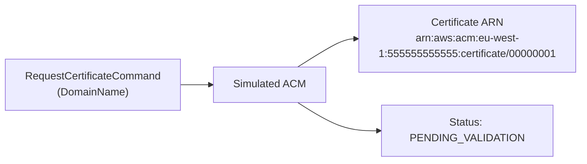

# Simulated ACM

Yulin includes a simulated AWS Certificate Manager (ACM) for tests and local development. In this
guide, you'll request certificates, configure DNS validation, filter certificate lists, and use ACM
with simulated CloudFormation.

## Prerequisites

- Install `@kensio/yulin` in your project.
- Import ACM commands from `@aws-sdk/client-acm`.
- Import `SimAws` from `@kensio/yulin`.

## Request a certificate

1. Create a `SimAws` instance and get a simulated ACM client.
2. Call `requestCertificate` with a `RequestCertificateCommand`.
3. Call `listCertificates` with a `ListCertificatesCommand` to confirm the certificate exists.

```typescript sim-acm-request-certificate
/**
 * Requesting a simulated ACM certificate.
 */

import {
  ListCertificatesCommand,
  RequestCertificateCommand,
} from "@aws-sdk/client-acm";

import { SimAws } from "@kensio/yulin";

const simAws = new SimAws();
const acm = simAws.account("555555555555").region("eu-west-1").acm();

const requestOutput = await acm.requestCertificate(
  new RequestCertificateCommand({
    DomainName: "example.test",
  }),
);

console.log(requestOutput.CertificateArn);

const listOutput = await acm.listCertificates(new ListCertificatesCommand());

console.log(listOutput.CertificateSummaryList?.[0]?.DomainName);
console.log(listOutput.CertificateSummaryList?.[0]?.Status);
```

Certificate ARNs include the selected simulated account and region, for example:



```text
arn:aws:acm:eu-west-1:555555555555:certificate/00000001
```

You can request multiple certificates for the same domain. Each request receives a distinct ARN.

## Add subject alternative names

Pass `SubjectAlternativeNames` when a certificate must cover more than one DNS name.

```typescript sim-acm-subject-alternative-names
/**
 * Requesting a simulated ACM certificate with subject alternative names.
 */

import {
  ListCertificatesCommand,
  RequestCertificateCommand,
} from "@aws-sdk/client-acm";

import { SimAws } from "@kensio/yulin";

const simAws = new SimAws();
const acm = simAws.acm();

const requestOutput = await acm.requestCertificate(
  new RequestCertificateCommand({
    DomainName: "example.test",
    SubjectAlternativeNames: ["www.example.test", "api.example.test"],
  }),
);

const listOutput = await acm.listCertificates(new ListCertificatesCommand());

console.log(requestOutput.CertificateArn);
console.log(
  listOutput.CertificateSummaryList?.[0]?.SubjectAlternativeNameSummaries,
);
```

`ListCertificatesCommand` includes up to 100 subject alternative names in each summary. If a
certificate has more than 100 names, `HasAdditionalSubjectAlternativeNames` is set on the summary.

## Describe a certificate and its validation records

Use `DescribeCertificateCommand` to inspect certificate details, including validation options.

```typescript sim-acm-describe-certificate
/**
 * Describing a simulated ACM certificate and its DNS validation records.
 */

import {
  DescribeCertificateCommand,
  RequestCertificateCommand,
} from "@aws-sdk/client-acm";

import { SimAws } from "@kensio/yulin";

const simAws = new SimAws();
const acm = simAws.acm();

const requestOutput = await acm.requestCertificate(
  new RequestCertificateCommand({
    DomainName: "example.test",
    SubjectAlternativeNames: ["www.example.test"],
    ValidationMethod: "DNS",
  }),
);

const describeOutput = await acm.describeCertificate(
  new DescribeCertificateCommand({
    CertificateArn: requestOutput.CertificateArn,
  }),
);

const certificate = describeOutput.Certificate;

console.log(certificate?.DomainName);
console.log(certificate?.Status);

const domainValidationOptions = certificate?.DomainValidationOptions ?? [];
for (const validation of domainValidationOptions) {
  console.log(validation.DomainName);
  console.log(validation.ValidationMethod);
  console.log(validation.ResourceRecord?.Name);
  console.log(validation.ResourceRecord?.Type);
  console.log(validation.ResourceRecord?.Value);
}
```

For DNS validation, simulated ACM returns CNAME validation records for the primary domain and each
subject alternative name. The records are deterministic, which makes them suitable for assertions in
tests.

For EMAIL validation, the validation method is recorded but no DNS resource record is returned.

```typescript sim-acm-email-validation
/**
 * Requesting a simulated ACM certificate with EMAIL validation.
 */

import {
  DescribeCertificateCommand,
  RequestCertificateCommand,
} from "@aws-sdk/client-acm";

import { SimAws } from "@kensio/yulin";

const simAws = new SimAws();
const acm = simAws.acm();

const requestOutput = await acm.requestCertificate(
  new RequestCertificateCommand({
    DomainName: "mail.example.test",
    ValidationMethod: "EMAIL",
  }),
);

const describeOutput = await acm.describeCertificate(
  new DescribeCertificateCommand({
    CertificateArn: requestOutput.CertificateArn,
  }),
);

const validation = describeOutput.Certificate?.DomainValidationOptions?.[0];

console.log(validation?.ValidationMethod);
console.log(validation?.ResourceRecord);
```

## Wait for certificate issuance

Requested certificates start in `PENDING_VALIDATION` status. Simulated ACM schedules background work
to move them to `ISSUED`.

If your test needs the issued state, wait for background tasks to complete before describing the
certificate.

> **Note:** Where a simulated Route53 hosted zone covers the certificate domain, issuance waits for
> DNS validation first.
> See [Validate a certificate against simulated Route53](#validate-a-certificate-against-simulated-route53)
> below.

```typescript sim-acm-background-issuance
/**
 * Waiting for a simulated ACM certificate to be issued.
 */

import {
  DescribeCertificateCommand,
  RequestCertificateCommand,
} from "@aws-sdk/client-acm";

import { SimAws } from "@kensio/yulin";

const simAws = new SimAws();
const acm = simAws.acm();

const requestOutput = await acm.requestCertificate(
  new RequestCertificateCommand({
    DomainName: "issued.example.test",
  }),
);

await simAws.backgroundTasksComplete();

const describeOutput = await acm.describeCertificate(
  new DescribeCertificateCommand({
    CertificateArn: requestOutput.CertificateArn,
  }),
);

console.log(describeOutput.Certificate?.Status);
console.log(describeOutput.Certificate?.IssuedAt);
```

## Validate a certificate against simulated Route53

Real ACM issues a DNS-validated certificate only once the CNAME it requests is resolvable. Simulated
ACM does the same, but only where the simulation can answer for the domain.

The rules are:

- If a simulated Route53 hosted zone covers the certificate domain, the certificate waits for its validation record.
- If no hosted zone covers the domain, the certificate is issued as soon as background tasks drain.

Templates commonly reference hosted zones managed by another team or another tool. Those
certificates keep working here because the simulation holds no zone for their domain.

```typescript sim-acm-dns-validation
/**
 * Validating a simulated ACM certificate against a simulated Route53 record.
 */

import {
  DescribeCertificateCommand,
  RequestCertificateCommand,
} from "@aws-sdk/client-acm";
import {
  ChangeResourceRecordSetsCommand,
  CreateHostedZoneCommand,
} from "@aws-sdk/client-route-53";

import { SimAws } from "@kensio/yulin";

const simAws = new SimAws();

const zoneOutput = await simAws.route53().createHostedZone(
  new CreateHostedZoneCommand({
    Name: "example.test",
    CallerReference: "acm-dns-validation",
  }),
);

const requestOutput = await simAws.acm().requestCertificate(
  new RequestCertificateCommand({
    DomainName: "api.example.test",
  }),
);

await simAws.backgroundTasksComplete();

// A hosted zone covers the domain, so the certificate waits for its record.
const pendingOutput = await simAws.acm().describeCertificate(
  new DescribeCertificateCommand({
    CertificateArn: requestOutput.CertificateArn,
  }),
);

console.log(pendingOutput.Certificate?.Status); // PENDING_VALIDATION

const validationRecord =
  pendingOutput.Certificate?.DomainValidationOptions?.[0]?.ResourceRecord;

await simAws.route53().changeResourceRecordSets(
  new ChangeResourceRecordSetsCommand({
    HostedZoneId: zoneOutput.HostedZone?.Id,
    ChangeBatch: {
      Changes: [
        {
          Action: "CREATE",
          ResourceRecordSet: {
            Name: validationRecord?.Name,
            Type: "CNAME",
            TTL: 300,
            ResourceRecords: [{ Value: validationRecord?.Value ?? "" }],
          },
        },
      ],
    },
  }),
);

await simAws.backgroundTasksComplete();

const issuedOutput = await simAws.acm().describeCertificate(
  new DescribeCertificateCommand({
    CertificateArn: requestOutput.CertificateArn,
  }),
);

console.log(issuedOutput.Certificate?.Status); // ISSUED
```

Each domain on a certificate is validated separately. A certificate with subject alternative names
is issued only once every domain that needs DNS validation has its record. Domains that are not
covered by any hosted zone don't need anything published for them. Until all domains are validated,
`DescribeCertificateCommand` reports `SUCCESS` for validated domains and `PENDING_VALIDATION` for
the rest.

Hosted zones are looked up across every simulated account, matching real ACM validating against
public DNS. A certificate in one account can be validated by a hosted zone in another.

### Skip the validation record

> **Note:** Use `completeDnsValidation()` when your test needs a hosted zone for reasons unrelated
> to certificate validation and you don't want to go through the full validation flow.

Call `completeDnsValidation()` on a pending certificate. It publishes the validation records and
resolves once the certificate is issued.

```typescript sim-acm-complete-dns-validation
/**
 * Completing simulated ACM DNS validation in one call.
 */

import {
  DescribeCertificateCommand,
  RequestCertificateCommand,
} from "@aws-sdk/client-acm";
import { CreateHostedZoneCommand } from "@aws-sdk/client-route-53";

import { SimAws } from "@kensio/yulin";

const simAws = new SimAws();

await simAws.route53().createHostedZone(
  new CreateHostedZoneCommand({
    Name: "example.test",
    CallerReference: "acm-shortcut",
  }),
);

const requestOutput = await simAws.acm().requestCertificate(
  new RequestCertificateCommand({
    DomainName: "api.example.test",
  }),
);

await simAws.acm().completeDnsValidation(requestOutput.CertificateArn);

const describeOutput = await simAws.acm().describeCertificate(
  new DescribeCertificateCommand({
    CertificateArn: requestOutput.CertificateArn,
  }),
);

console.log(describeOutput.Certificate?.Status); // ISSUED
```

### Override when validation is required

Two methods override the default behavior when the hosted zone heuristic doesn't match your test's
needs:

| Method | Behavior |
|---|---|
| `simAws.acm().autoIssueCertificates()` | Never requires validation. Use this when a hosted zone exists for unrelated reasons and you don't care about certificates. |
| `simAws.acm().requireDnsValidation()` | Always requires DNS validation. Use this to exercise the validation path without creating a hosted zone first. |

A standalone `new SimAcm()` instance has no simulated Route53, so it always issues certificates
immediately. Calling `requireDnsValidation()` on one throws, because nothing can publish the record
it would then wait for.

## List and filter certificates

Use `ListCertificatesCommand` to inspect certificates in the selected simulated account and region.

```typescript sim-acm-list-certificates
/**
 * Listing simulated ACM certificates.
 */

import {
  ListCertificatesCommand,
  RequestCertificateCommand,
} from "@aws-sdk/client-acm";

import { SimAws } from "@kensio/yulin";

const simAws = new SimAws();
const acm = simAws.acm();

await acm.requestCertificate(
  new RequestCertificateCommand({
    DomainName: "one.example.test",
  }),
);

await acm.requestCertificate(
  new RequestCertificateCommand({
    DomainName: "two.example.test",
  }),
);

const listOutput = await acm.listCertificates(
  new ListCertificatesCommand({
    MaxItems: 10,
  }),
);

const certificateSummaries = listOutput.CertificateSummaryList ?? [];
for (const summary of certificateSummaries) {
  console.log(summary.CertificateArn);
  console.log(summary.DomainName);
  console.log(summary.Status);
}
```

Certificates are listed in creation order. `MaxItems` must be between 1 and 1000 and defaults to
100. When more results are available, pass `NextToken` from the response into your next request.

To filter by status, pass `CertificateStatuses` to `ListCertificatesCommand`.

```typescript sim-acm-list-issued-certificates
/**
 * Filtering simulated ACM certificates by status.
 */

import {
  ListCertificatesCommand,
  RequestCertificateCommand,
} from "@aws-sdk/client-acm";

import { SimAws } from "@kensio/yulin";

const simAws = new SimAws();
const acm = simAws.acm();

await acm.requestCertificate(
  new RequestCertificateCommand({
    DomainName: "issued.example.test",
  }),
);

await simAws.backgroundTasksComplete();

const listOutput = await acm.listCertificates(
  new ListCertificatesCommand({
    CertificateStatuses: ["ISSUED"],
  }),
);

console.log(listOutput.CertificateSummaryList?.map((cert) => cert.DomainName));
```

## Add tags to a certificate

Pass `Tags` when requesting a certificate. Simulated ACM accepts up to 50 tags, matching the ACM
request limit. Requests with more than 50 tags throw `TooManyTagsException`.

```typescript sim-acm-tags
/**
 * Requesting a simulated ACM certificate with tags.
 */

import { RequestCertificateCommand } from "@aws-sdk/client-acm";

import { SimAws } from "@kensio/yulin";

const simAws = new SimAws();
const acm = simAws.acm();

await acm.requestCertificate(
  new RequestCertificateCommand({
    DomainName: "tagged.example.test",
    Tags: [
      {
        Key: "Purpose",
        Value: "local-test",
      },
      {
        Key: "Owner",
        Value: "docs",
      },
    ],
  }),
);
```

## Scope certificates to an account and region

Use `SimAws` scopes to create ACM certificates in different simulated accounts and regions. ACM
state is scoped to the selected account and region — certificates requested in one scope don't
appear in another.

```typescript sim-acm-account-region-scoping
/**
 * Simulated ACM account and region scoping.
 */

import { RequestCertificateCommand } from "@aws-sdk/client-acm";

import { SimAws } from "@kensio/yulin";

const simAws = new SimAws();

const defaultAcm = simAws.acm();
const euWest2Acm = simAws.region("eu-west-2").acm();
const accountAcm = simAws.account("111111111111").acm();
const scopedAcm = simAws.account("222222222222").region("ap-east-1").acm();

await defaultAcm.requestCertificate(
  new RequestCertificateCommand({
    DomainName: "default.example.test",
  }),
);

await euWest2Acm.requestCertificate(
  new RequestCertificateCommand({
    DomainName: "eu-west-2.example.test",
  }),
);

await accountAcm.requestCertificate(
  new RequestCertificateCommand({
    DomainName: "account.example.test",
  }),
);

await scopedAcm.requestCertificate(
  new RequestCertificateCommand({
    DomainName: "scoped.example.test",
  }),
);
```

Each `SimAws` instance has its own isolated state. Create a fresh instance per test or share one across related local setup.

## Create a certificate with CloudFormation

Simulated CloudFormation can create ACM certificates from `AWS::CertificateManager::Certificate`.

For `AWS::CertificateManager::Certificate`:

- `Ref` returns the certificate ARN.
- `Fn::GetAtt` supports `CertificateArn` and `CertificateStatus`.

Supported certificate properties:

| Property | Description |
|---|---|
| `DomainName` | Primary domain for the certificate. |
| `SubjectAlternativeNames` | Additional DNS names to cover. |
| `ValidationMethod` | `DNS` or `EMAIL`. |
| `DomainValidationOptions` | Validation options per domain, including `HostedZoneId`. |
| `Tags` | Up to 50 key-value tags. |

```typescript sim-acm-cloudformation-certificate
/**
 * Creating an ACM certificate through simulated CloudFormation.
 */

import {
  DescribeCertificateCommand,
  ListCertificatesCommand,
} from "@aws-sdk/client-acm";

import { SimAws } from "@kensio/yulin";

const simAws = new SimAws();

const stack = await simAws.cloudFormation().deployTemplate({
  stackName: "acm-certificate-stack",
  template: {
    Resources: {
      SiteCertificate: {
        Type: "AWS::CertificateManager::Certificate",
        Properties: {
          DomainName: "example.test",
          SubjectAlternativeNames: ["www.example.test"],
          ValidationMethod: "DNS",
          DomainValidationOptions: [
            {
              DomainName: "example.test",
              ValidationDomain: "example.test",
            },
          ],
          Tags: [
            {
              Key: "Purpose",
              Value: "local-test",
            },
          ],
        },
      },
    },
    Outputs: {
      CertificateArn: {
        Value: {
          Ref: "SiteCertificate",
        },
      },
      CertificateStatus: {
        Value: {
          "Fn::GetAtt": ["SiteCertificate", "CertificateStatus"],
        },
      },
    },
  },
});

const certificateArn = stack.outputs.get("CertificateArn")?.value;
if (typeof certificateArn !== "string")
  throw new Error("No CertificateArn Output");

const listOutput = await simAws
  .acm()
  .listCertificates(new ListCertificatesCommand());

const describeOutput = await simAws.acm().describeCertificate(
  new DescribeCertificateCommand({
    CertificateArn: certificateArn,
  }),
);

console.log(stack.outputs.get("CertificateStatus")?.value);
console.log(listOutput.CertificateSummaryList?.[0]?.DomainName);
console.log(describeOutput.Certificate?.Status);
```

### Validate a certificate from the template

Give a `DomainValidationOptions` entry a `HostedZoneId` and simulated CloudFormation publishes the validation record itself, the same way real CloudFormation does. This is what CDK emits for `CertificateValidation.fromDns(zone)`, so a CDK-synthesized template works without changes.

A certificate resource is not complete until the certificate is issued — anything depending on the certificate is created after it exists, as in real CloudFormation.

```typescript sim-acm-cloudformation-dns-validation
/**
 * Validating an ACM certificate from a simulated CloudFormation template.
 */

import { SimAws } from "@kensio/yulin";

const simAws = new SimAws();

const stack = await simAws.cloudFormation().deployTemplate({
  stackName: "acm-dns-validation-stack",
  template: {
    Resources: {
      Zone: {
        Type: "AWS::Route53::HostedZone",
        Properties: {
          Name: "example.test",
        },
      },
      SiteCertificate: {
        Type: "AWS::CertificateManager::Certificate",
        Properties: {
          DomainName: "api.example.test",
          ValidationMethod: "DNS",
          DomainValidationOptions: [
            {
              DomainName: "api.example.test",
              HostedZoneId: { Ref: "Zone" },
            },
          ],
        },
      },
    },
    Outputs: {
      CertificateStatus: {
        Value: {
          "Fn::GetAtt": ["SiteCertificate", "CertificateStatus"],
        },
      },
    },
  },
});

await stack.waitForDeployComplete();

// The hosted zone, the validation record and the issued certificate, from one
// template deploy.
console.log(stack.outputs.get("CertificateStatus")?.value); // ISSUED
```

`HostedZoneId` accepts a `Ref` to an `AWS::Route53::HostedZone` in the same template, or the literal ID of a zone created outside the stack.

A `HostedZoneId` that names a hosted zone the simulator doesn't hold is skipped rather than failing. Route53 is often managed by another team or another tool. The certificate then follows the usual rule from [Validate a certificate against simulated Route53](#validate-a-certificate-against-simulated-route53): with nothing authoritative for its domain, it's issued without validation.

If a hosted zone covers the domain but the validation record never appears, the stack fails rather than hanging. Real CloudFormation sits in `CREATE_IN_PROGRESS` for hours before timing out — that's not useful in a test, so the resource fails immediately and names the record it waited for.

## Available functionality

Simulated ACM supports:

- `RequestCertificateCommand`, `DescribeCertificateCommand`, and `ListCertificatesCommand`
- DNS validation against records in simulated Route53
- CloudFormation-published validation records from `DomainValidationOptions[].HostedZoneId`
- EMAIL validation method shapes (validation always succeeds regardless)
- Subject alternative names
- Certificate tags, up to the ACM limit of 50
- Deterministic certificate ARNs scoped to account and region
- Deterministic DNS validation CNAME records
- Background certificate issuance from `PENDING_VALIDATION` to `ISSUED`
- Per-domain validation status for multi-domain certificates
- The `AWS::CertificateManager::Certificate` CloudFormation resource, with `Ref` and `Fn::GetAtt`

Unsupported ACM options might be ignored or might throw errors, depending on whether the simulator needs them to model the requested behavior.

## Limitations

| Limitation | Detail |
|---|---|
| Certificate deletion | Not supported. |
| Certificate renewal | Not supported. |
| Imported certificates | Not supported. |
| EMAIL validation | Always succeeds; only DNS validation is enforced. |
| DNS validation scope | Checked against simulated Route53 only, never against real DNS. |
| Validation timeout | A certificate requested through the SDK whose record never appears stays `PENDING_VALIDATION`. A CloudFormation certificate fails its stack instead. |
| HTTP API | ACM is not served as an HTTP API by `serveSimAws`. |
